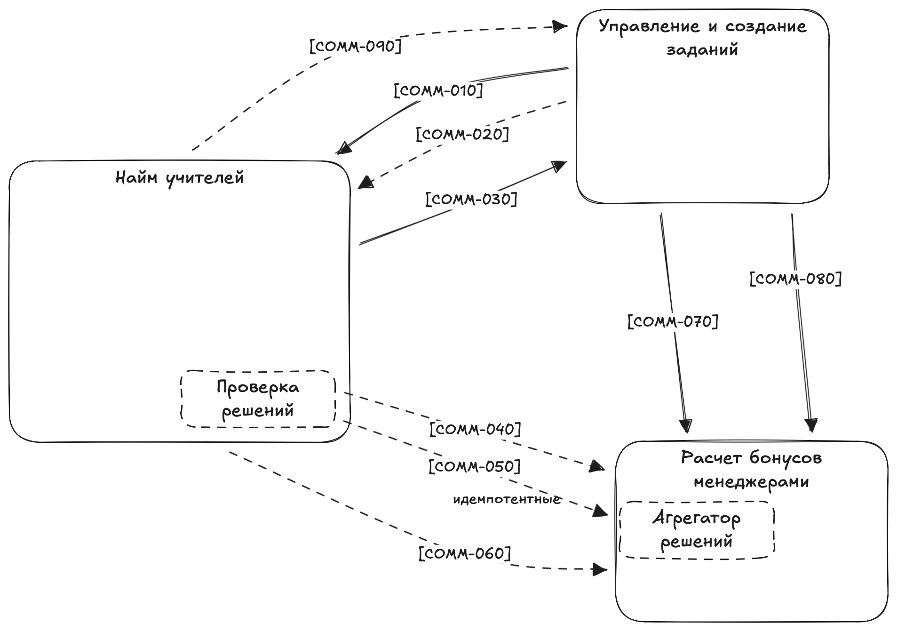

# Домашнее задание урока 0

## Разбор проблем

### Problem-010

**Проблема**: долго определяется правильность выполнения задания от кандидата. Это вызывает задержки, которые бесят менеджеров и кандидатов в учителя.

**Решение**: нужен отдельный сервис с N воркерами, которые будут быстро проверять задания кандидатов в учителя, масштабироваться в случае необходимости.

### Problem-020

**Проблема**: Кандидаты в учителя читерят систему в месте, где простое задание должно усложниться, но этого ещё не произошло. Для этого они собираются в группы, где делятся лёгкими заданиями между собой, и, пока задание обновляется, пачкой выполняют лёгкие версии.

**Решение**: Быстро определять легкие задания, добавить критерии "легкости". Делать временные блокировки для легких задач для их перепроверки.

### Problem-021

**Проблема**: Главная проблема тут в том, что нужно как можно быстрее менять задание для кандидатов в учителя, после того, как менеджер поправит задание.

**Решение**: Быстрое обновление поправленной задачи - асинхронно или банчами [COMM-030]

### Problem-030

**Проблема**: Логика начисления бонусов некорректна из-за ошибки с рейтингом задания. Во время начисления бонусов во время изменения рейтинга, происходит задержка, которая не удовлетворяет бизнес (нужно моментально).

**Решение**: профилировать и найти проблему задержки расчетов, это должна быть быстрая операция, возможно использовать предварительный расчет с кэшированием промежуточных результатов. Сделать коммуникации [COMM-040] и [COMM-050] асинхронными.

### Problem-040

**Проблема**: медленно начисляются бонусы менеджерам, потому что много кандидатов в учителя. Иногда вся система падает и не восстанавливается.

**Решение**: Не считать весь бонус сразу, а иметь предрасчет и только корректировать его ("заплатим" доп. памятью за скорость), проверить атомарность группы операции.

### Problem-050

**Проблема**: В UI может отобразиться ошибка каких-то запросов после успешного выполнения задания. Разработчики объясняют это поведением вызовом сервиса оплаты и создания заданий.

**Решение**: Разобраться с отображением ошибок, убрать не критические из UI. Добавить ретраи и заглушки к ошибкам, понять из зависимости и что всё асинхронно.

### Problem-060

**Проблема**: Нужно сократить расходы на скейлинг сервиса заданий. Сейчас дорого.

**Решение**: Профилирование и оптимизация операций - работа с БД, кэширование, распределение нагрузки.

### Problem-070

**Проблема**: Менеджерам иногда начисляются бонусы дважды. Это связано с тем, что, когда кандидаты в учителя отправляют то же самое задание повторно, система тупит Problem-050. Разработчики объясняют тем, что управление заданиями падает, а бонусами — нет. Из-за этого бонусы попадают в два одинаковых запроса.

**Решение**: Дедубликация запросов для расчетов бонусов, связать данные из системы бонусов с данными из системы заданий, обрабатывать их только есть записи из обоих источников.

### Problem-080

**Проблема**: Сервис создания заданий или бонусов кладёт всю систему, и кандидаты в учителя не могут выполнять задания.

**Решение**: Убрать эту связанность через асинхронные вызовы и обработку ошибок.

### Problem-090

**Проблема**: Фичи выходят слишком медленно. Это связано с тем, что для выполнения любой фичи нужно изучить всю систему и проверить, что ничего не упало. Короче, разработчики сами не понимают, как работает система вне отдельного сервиса.

**Решение**: Не держать в 1 сервисе много различных функций, вынести сложные части в отдельные сервисы или модули, если решаем оставить все одном.

### Problem-100

**Проблема**: Данные теряются вокруг логики выполнения заданий кандидатами в учителя.

**Решение**: Контроль целостности данных, хранение состояния работы для учителя.

### Problem-101

**Проблема**: В системе нет никакой обработки ошибок и инструментов, связанных с ретраями и прочим. Единственное — сам брокер работает корректно, а проблемы могут возникнуть только либо в момент продьюсинга, либо в момент консьюминга событий. При этом бизнес устраивает, что сейчас система состоит из трёх сервисов. Не нужно менять сервисы и их границы, потому что бизнес планирует расширяться.

**Решение**: Добавить базовые вещи - логирование ошибок, очереди повторов, мониторинг состояния сервисов. Возможно, пересмотреть границы сервисов с оценкой "цены" за это.

